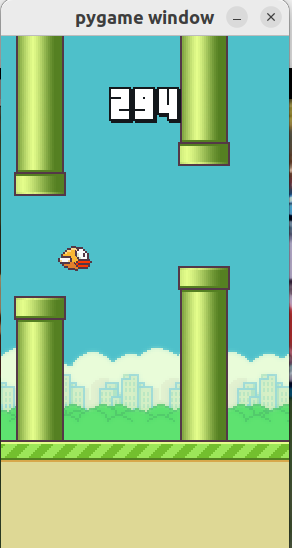
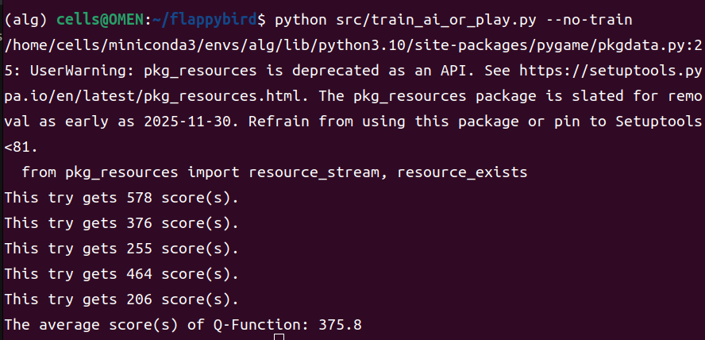
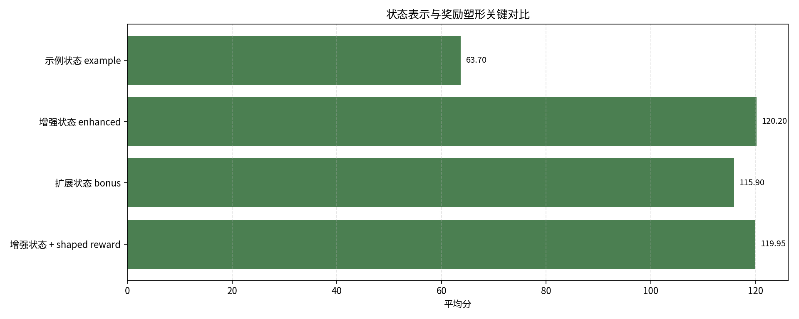
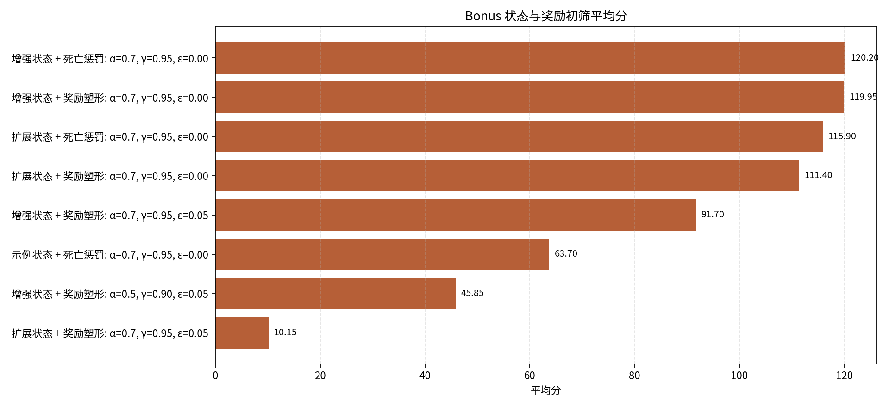
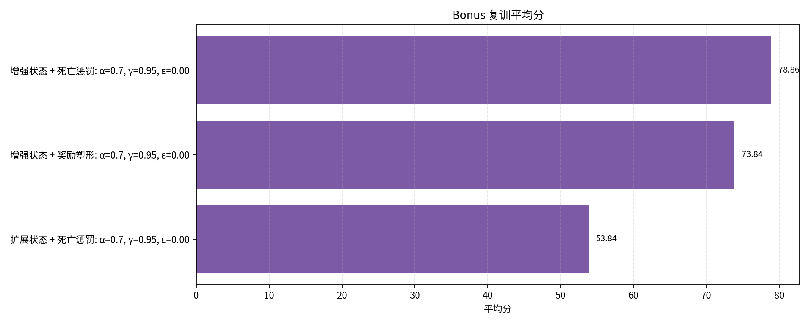
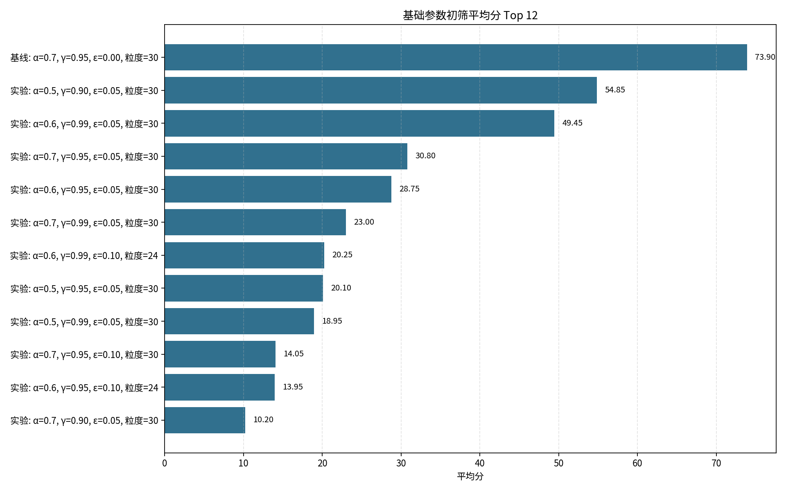
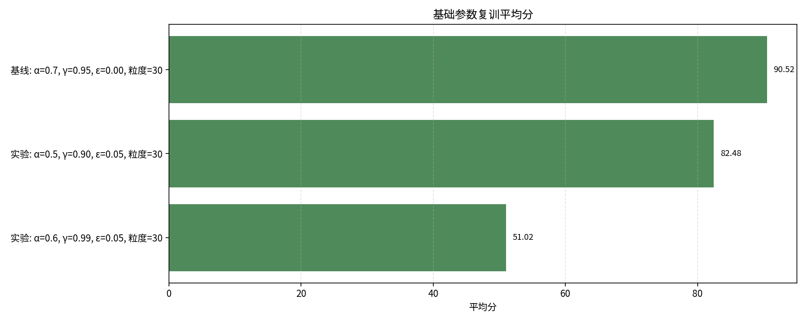
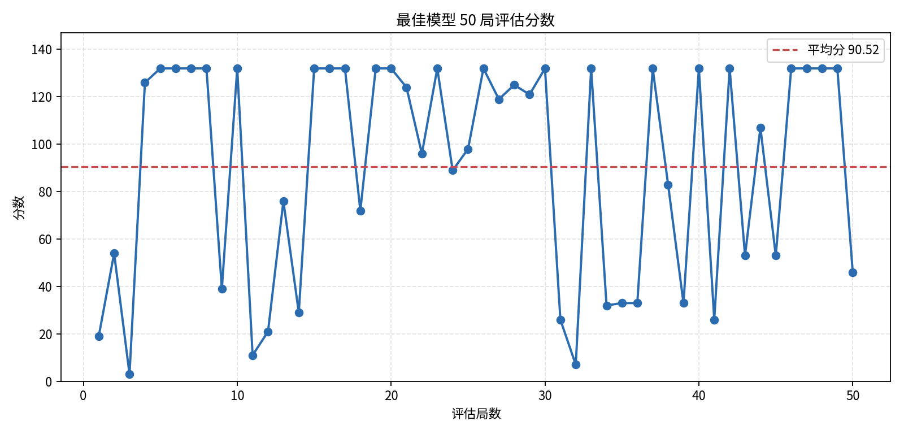

# Flappy Bird Q-learning 实验报告

## 摘要

本项目使用表格型 Q-learning 为 Flappy Bird 训练智能体。智能体通过与游戏环境反复交互，学习在不同状态下选择“不扇动”或“flap”的 Q 值，从而逐步形成能够穿越管道、避免碰撞的策略。

本项目完成了作业必做内容：补全 `GameAI`、调整训练参数、保存最佳模型，并额外完成 bonus1 状态表示设计和 bonus2 奖励塑形实验。最终基础最佳模型保存为 `q_best.pkl`，50 局固定评估平均分为 `90.52`，最高分为 `132`。在展示脚本中，模型也能在若干随机局中跑出更高分数，例如 5 局平均 `375.8`。





## 1. 项目目标与代码结构

作业目标是为 Flappy Bird 训练一个强化学习智能体，使其尽可能获得高分。本项目使用 `flappy-bird-gymnasium` 提供环境，使用 Q-learning 进行训练，不使用 DQN 或神经网络。

主要文件如下：

| 文件 | 作用 |
| --- | --- |
| `src/q_learning.py` | Q-learning 智能体、状态处理、训练和测试逻辑 |
| `src/experiment.py` | 参数搜索、bonus 实验、多 worker 训练和结果保存 |
| `src/watch_best.py` | 直接加载模型并观看或无渲染验证表现 |
| `q_best.pkl` | 最终基础最佳 Q 表模型 |
| `q_bonus_best.pkl` | bonus 对比实验中保存的最佳模型 |
| `results/experiment_results.csv` | 基础参数实验完整结果 |
| `results_bonus/experiment_results.csv` | bonus 状态/奖励实验完整结果 |
| `assets/charts/` | 报告可视化图表 |

## 2. 强化学习与 Q-learning 如何提高分数

### 2.1 强化学习建模

Flappy Bird 可以自然建模为一个马尔科夫决策过程：

| MDP 元素 | 本项目中的对应含义 |
| --- | --- |
| 状态 `s` | 小鸟和最近管道的相对位置、小鸟速度等离散化观测 |
| 动作 `a` | `0` 表示不扇动，`1` 表示 flap |
| 奖励 `r` | 存活、过管、死亡、触顶等环境反馈 |
| 策略 `π(s)` | 给定状态时选择 Q 值最大的动作 |
| 目标 | 最大化长期累计奖励，也就是尽量活得久、通过更多管道 |

在游戏早期，智能体几乎不知道什么时候该 flap，因此会频繁撞管或落地。随着训练进行，智能体不断收集 `(s, a, s', r)` 样本，并把“哪些动作导致更高长期回报”写入 Q 表。最终，测试时只要查询当前状态下两个动作的 Q 值，就可以选择更优动作。

### 2.2 GameAI 代码框架说明

`GameAI` 中的核心数据结构是：

```python
self.q[(tuple(state), action)] = q_value
```

也就是说，Q 表记录了“在某个离散状态下采取某个动作”的价值。核心函数如下：

| 函数 | 作用 |
| --- | --- |
| `get_q_value(state, action)` | 查询 Q 表；未见过的状态动作对返回 0 |
| `best_future_reward(state)` | 查询新状态下所有动作的最大未来 Q 值 |
| `update(old_state, action, new_state, reward)` | 根据 Q-learning 公式更新 Q 值 |
| `choose_action(state, use_epsilon)` | 训练时 epsilon-greedy，测试时选择最优动作 |
| `available_actions(state)` | 返回合法动作 `{0, 1}` |

Q-learning 更新公式为：

```text
Q(s, a) <- Q(s, a) + alpha * (reward + gamma * max_a' Q(s', a') - Q(s, a))
```

其中：

- `alpha` 是学习率，决定新样本对旧 Q 值的覆盖速度。
- `gamma` 是折扣因子，决定智能体重视长期奖励的程度。
- `max_a' Q(s', a')` 是对未来最优回报的估计。
- `reward` 是当前动作直接带来的反馈。

通过这个公式，智能体会把“当前动作造成死亡”的负面结果反向传播到旧状态，也会把“当前动作帮助过管或存活”的正面结果积累到 Q 表中。

### 2.3 epsilon-greedy 与最终策略

训练时，`choose_action` 使用 epsilon-greedy：

- 以 `epsilon` 的概率随机探索；
- 以 `1 - epsilon` 的概率选择当前 Q 值最大的动作；
- 如果两个动作 Q 值相同，则随机选择一个并列最优动作。

最终基础最佳模型使用 `epsilon=0`。这并不意味着训练完全没有探索，因为训练早期大量状态的两个动作 Q 值相同，代码会在并列最优动作中随机选择。随着 Q 表逐渐成型，`epsilon=0` 能减少额外随机 flap。在 Flappy Bird 中，随机 flap 很容易导致撞管或触顶，死亡惩罚又很大，因此额外探索反而可能拉低最终表现。

## 3. 状态表示设计与 bonus1

### 3.1 环境观测 obs

环境返回 12 维观测：

| 下标 | 含义 |
| --- | --- |
| `obs[0:3]` | 第一个可见管道的水平位置、上管道底部、下管道顶部 |
| `obs[3:6]` | 下一个管道的水平位置、上管道底部、下管道顶部 |
| `obs[6:9]` | 下下个管道的水平位置、上管道底部、下管道顶部 |
| `obs[9]` | 小鸟纵向位置 |
| `obs[10]` | 小鸟纵向速度 |
| `obs[11]` | 小鸟旋转角 |

由于 Q 表需要离散 key，连续观测会乘以 `obs_mul_factor` 后取整。本项目默认使用 `obs_mul_factor=30`。

### 3.2 最近管道选择

游戏画面中可能同时存在多个管道。智能体控制当前动作时，最重要的是“最近且尚未完全通过的管道”。代码中根据管道水平位置和小鸟固定水平位置判断：

```text
如果第一个管道已经完全位于小鸟身后，则使用下一个管道；
否则仍使用第一个管道。
```

这样可以避免小鸟已经通过某个管道后，状态仍被旧管道干扰。

### 3.3 三种状态表示

本项目实现了三种 `state_mode`：

| state_mode | 状态特征 | 设计思路 |
| --- | --- | --- |
| `example` | `pipe_x - player_x`、`pipe_bottom - player_y`、`player_v` | 作业示例方法，关注水平距离、下管道距离和速度 |
| `enhanced` | `pipe_x - player_x`、`player_y - gap_center`、`pipe_bottom - player_y`、`player_v` | 加入小鸟与缺口中心的相对位置，直接表达“飞向缺口中心”的目标 |
| `bonus` | `pipe_x - player_x`、`player_y - gap_center`、`player_y - pipe_top`、`pipe_bottom - player_y`、`player_v`、`player_rot` | 进一步加入上下管道边界和旋转角，提供更完整的飞行姿态信息 |

### 3.4 bonus1 对比分析



在 bonus 初筛实验中，“示例状态 + 死亡惩罚”的平均分为 `63.70`，而“增强状态 + 死亡惩罚”达到 `120.20`，“扩展状态 + 死亡惩罚”达到 `115.90`。这说明相较于只使用下管道距离，加入“到缺口中心的垂直差”能显著提升状态表达能力。

`bonus` 状态在初筛中也很强，但复训后平均分下降到 `53.84`。可能原因是状态维度从 4 维增加到 6 维后，离散状态空间变得更稀疏；在同样训练局数下，Q 表对每个状态动作对的访问次数减少，导致策略稳定性变差。

结论：bonus1 中更合理的状态设计确实能提高训练早期表现；最终基础最佳模型选择 `enhanced`，因为它在表达能力和 Q 表规模之间取得了更好的平衡。

## 4. Reward 设计与 bonus2

### 4.1 基础奖励

环境原始奖励大致为：

| 情况 | 原始奖励 |
| --- | ---: |
| 每帧存活 | `+0.1` |
| 成功通过管道 | `+1.0` |
| 死亡 | `-1.0` |
| 触顶 | `-0.5` |

基础实验保留存活和过管奖励，但把死亡奖励从 `-1` 放大为 `-1000`：

```python
if reward == -1:
    reward = -1000
```

这样做的原因是 Flappy Bird 的核心目标首先是避免死亡。如果死亡惩罚太小，智能体可能不够重视危险状态，导致 Q 表难以形成稳定避障策略。

### 4.2 bonus2 奖励塑形

bonus2 新增 `reward_mode="shaped"`。在死亡惩罚基础上，增加姿态相关的密集反馈：

```text
shaped_reward =
    env_reward
    + center_bonus
    - velocity_penalty
    - flap_penalty
    - top_penalty
```

各项含义如下：

| 项 | 设计目的 |
| --- | --- |
| `center_bonus` | 小鸟越接近管道缺口中心，奖励越高 |
| `velocity_penalty` | 垂直速度越大，惩罚越大，鼓励平稳飞行 |
| `flap_penalty` | 对 flap 给极小惩罚，避免过度抖动 |
| `top_penalty` | 触顶或接近顶部时给予较大惩罚 |

### 4.3 bonus2 对比分析



bonus 初筛中，“增强状态 + 奖励塑形”的平均分为 `119.95`，非常接近原奖励“增强状态 + 死亡惩罚”的 `120.20`。这说明 reward shaping 没有破坏原任务目标，并能提供更细密的飞行姿态反馈。



但在 100000 局复训后，“增强状态 + 奖励塑形”的平均分为 `73.84`，低于原奖励“增强状态 + 死亡惩罚”的 `78.86`，也低于基础最佳模型 `q_best.pkl` 的 `90.52`。可能原因是当前塑形系数偏保守或存在局部偏好：智能体会被鼓励靠近缺口中心和平稳飞行，但这不总是等价于长期最高过管分数。

结论：bonus2 奖励塑形提供了有效的中间反馈，初筛表现很好；但最终最佳模型仍选择基础奖励方案，因为复训评估中原奖励更稳定。

## 5. 参数调整实验

### 5.1 实验设置

基础实验共初筛 18 组参数：

- 每组训练 `30000` 局；
- 每组评估 `20` 局；
- 选择初筛前 3 组；
- 前 3 组再训练 `100000` 局；
- 复训模型评估 `50` 局；
- 训练每局最多 `1000` 步，避免高分策略导致单局过长；
- 评估每局最多 `5000` 步。

实验脚本支持 `ThreadPoolExecutor` 和 `ProcessPoolExecutor`。由于 Gym 环境交互和 Q 表更新主要是 Python/CPU 逻辑，完整实验使用 `process` 后端绕开 GIL；CUDA/PyTorch 用于均值、标准差等张量统计以及候选模型排序。

### 5.2 初筛结果



初筛前三如下：

| 参数设置 | alpha | gamma | epsilon | obs_mul_factor | 初筛均分 | 最高分 |
| --- | ---: | ---: | ---: | ---: | ---: | ---: |
| 基线参数 | 0.7 | 0.95 | 0.00 | 30 | 73.90 | 132 |
| 较低学习率、较短期折扣、少量探索 | 0.5 | 0.90 | 0.05 | 30 | 54.85 | 132 |
| 中等学习率、长期折扣、少量探索 | 0.6 | 0.99 | 0.05 | 30 | 49.45 | 132 |

可以看到，`epsilon=0` 的基线参数初筛最好。原因并不是完全没有探索，而是 Q 值相同的未见状态会随机选择动作；同时避免了额外 epsilon 探索带来的随机死亡。

### 5.3 复训结果



复训结果如下：

| 参数设置 | alpha | gamma | epsilon | obs_mul_factor | 复训均分 | 最低分 | 最高分 | 标准差 |
| --- | ---: | ---: | ---: | ---: | ---: | ---: | ---: | ---: |
| 基线参数 | 0.7 | 0.95 | 0.00 | 30 | 90.52 | 3 | 132 | 46.38 |
| 较低学习率、较短期折扣、少量探索 | 0.5 | 0.90 | 0.05 | 30 | 82.48 | 2 | 132 | 47.13 |
| 中等学习率、长期折扣、少量探索 | 0.6 | 0.99 | 0.05 | 30 | 51.02 | 4 | 132 | 35.56 |

最终基础最佳模型为“基线参数”，已保存为 `q_best.pkl`。

### 5.4 最佳模型 50 局分数走势



50 局评估分数存在较大波动，最低分为 `3`，最高分为 `132`。这是因为 Flappy Bird 的管道序列和早期动作非常敏感，一次错误 flap 可能迅速导致死亡。不过模型多次达到 `132` 分，说明 Q 表已经学到了较有效的过管策略。

### 5.5 参数影响分析

学习率 `alpha`：

- `alpha=0.7` 的基线参数表现最好，说明较快吸收新样本有利于当前任务。
- `alpha=0.5/0.6` 也能学习到策略，但复训均分低于基线参数。
- `alpha` 过高可能导致 Q 值震荡，但本实验范围内 `0.7` 比较合适。

折扣因子 `gamma`：

- `gamma=0.95` 在最终最佳模型中表现最好。
- `gamma=0.99` 更重视远期收益，但在部分组合中不稳定。
- `gamma=0.90` 更重视近期奖励，能取得一定成绩，但长期过管策略略弱。

探索率 `epsilon`：

- `epsilon=0` 最终最好，因为并列 Q 值已经提供了早期随机探索。
- `epsilon=0.05` 可用，但额外随机动作可能造成死亡。
- `epsilon=0.10` 多数组合明显下降，说明随机探索过强。

状态离散系数 `obs_mul_factor`：

- `30` 表现最好。
- `24` 状态较粗，容易混淆不同位置。
- `36` 状态更细，但 Q 表更稀疏，同样训练量下覆盖不足。

## 6. 可视化总结

基础参数实验显示，基线参数在初筛和复训中都保持领先：


bonus 实验显示，状态表示和奖励塑形在初筛中很强，但复训稳定性仍不如基础最佳：


状态与奖励关键对比显示：`enhanced` 相比作业示例 `example` 有明显提升，说明缺口中心相对位置是 Flappy Bird 控制任务中的关键信息：


## 7. 运行方式

查看最佳模型画面：

```bash
conda run -n alg python src/watch_best.py
```

无渲染查看分数：

```bash
conda run -n alg python src/watch_best.py --no-render --episodes 5
```

重新运行基础参数实验：

```bash
conda run -n alg python src/experiment.py --executor process --workers 6
```

重新运行 bonus 对比实验：

```bash
conda run -n alg python src/experiment.py \
  --grid bonus \
  --executor process \
  --workers 6 \
  --results-dir results_bonus \
  --best-model-path q_bonus_best.pkl
```

重新生成图表：

```bash
conda run -n alg python scripts/generate_report_charts.py
```

## 8. 结论

本项目完成了 Q-learning 智能体代码补全、参数调整、最佳模型保存、bonus1 状态设计、bonus2 奖励塑形和图文报告。

最终结论如下：

- Q-learning 能通过 Q 表逐步学习状态动作价值，显著提高 Flappy Bird 分数。
- `enhanced` 状态表示加入缺口中心信息，比作业示例状态更有效。
- `bonus` 状态加入更多特征后初筛表现强，但 Q 表更稀疏，复训稳定性下降。
- reward shaping 能提供更密集反馈，但当前塑形系数下复训表现没有超过基础奖励。
- 最终最佳模型为 `q_best.pkl`，50 局固定评估平均分 `90.52`，最高分 `132`。

因此，最终提交模型保留基础最佳 `enhanced + death_penalty` 方案，bonus 模型和对比结果作为扩展实验提交。
